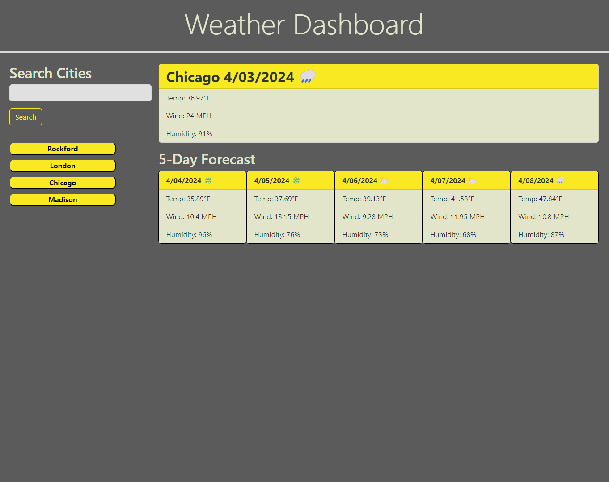

# challenge-06-weather-dashboard

## Description

This is a project for UW bootcamp in which we were asked to create a weather dashboard that will display the current weather and five day forecast for a selected city.

## Installation

N/A

## Usage

On searching for a city, that city's current weather and five day forecast will be displayed on the page. The searched city will be added to the search bar as a button and saved in local storage. Any city can be clicked on once it is added to the search bar and its weather data will be displayed.

Link to deployed application: https://ktunebe.github.io/challenge-06-weather-dashboard/

## Credits
Weather data obtained via the OpenWeather API from https://openweathermap.org/

## License

N/A